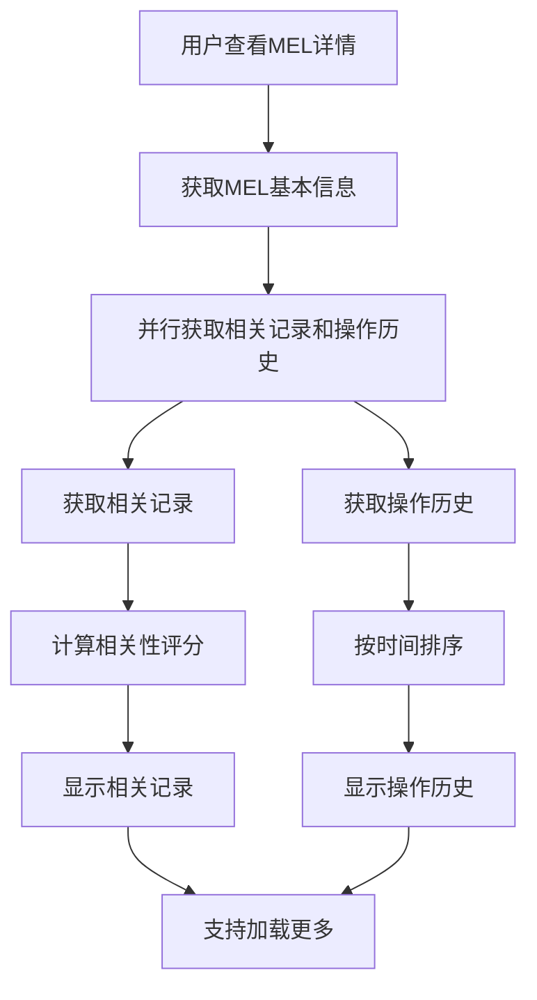

# MEL 详情展示页面设计

## 概述

基于 MEL 模块架构，设计 MEL 详情展示相关的页面，提供完整的 MEL 记录信息展示、相关记录推荐和操作历史记录功能。

## 页面结构

### 1. MEL 详情页 (`/pages/mel/detail/index.vue`)

#### 1.1 页面功能
- 展示完整的 MEL 记录信息
- 区分主基地和外站数据展示
- 提供相关 MEL 记录推荐
- 支持操作历史记录查看
- 提供打印和分享功能

#### 1.2 页面布局
```
┌─────────────────────────────────────┐
│ 数据来源标识                        │
├─────────────────────────────────────┤
│ 基础信息卡片                        │
│ ┌─────────────────────────────────┐ │
│ │ DDF单号: DDF2025001           │ │
│ │ MEL编号: MEL001               │ │
│ │ 飞机注册号: B-1234            │ │
│ │ 机型: A320                    │ │
│ │ ATA章节: 27-00                │ │
│ │ 状态: [已批准]                │ │
│ └─────────────────────────────────┘ │
├─────────────────────────────────────┤
│ 故障描述卡片                        │
│ ┌─────────────────────────────────┐ │
│ │ 故障描述: ...                  │ │
│ │ English Description: ...       │ │
│ └─────────────────────────────────┘ │
├─────────────────────────────────────┤
│ 主基地特有信息 (条件显示)             │
│ ┌─────────────────────────────────┐ │
│ │ 保留信息                        │ │
│ │ 保留类型: A                    │ │
│ │ 保留依据: ...                  │ │
│ │ 保留原因: ...                  │ │
│ │ 保留日期: 2023-01-01          │ │
│ └─────────────────────────────────┘ │
│ ┌─────────────────────────────────┐ │
│ │ 修复期限                        │ │
│ │ 修复期限(日历日): 30           │ │
│ │ 修复期限(FH): 100              │ │
│ │ 修复期限(FC): 50               │ │
│ │ 修复期限(飞行日): 15           │ │
│ └─────────────────────────────────┘ │
│ ┌─────────────────────────────────┐ │
│ │ 维修措施                        │ │
│ │ 单位操作措施: ...               │ │
│ │ 维修措施: ...                  │ │
│ │ 纠正措施: ...                  │ │
│ │ 是否必检: 是                   │ │
│ └─────────────────────────────────┘ │
│ ┌─────────────────────────────────┐ │
│ │ 运行限制                        │ │
│ │ 运行限制: ...                  │ │
│ │ 运行限制详细: ...              │ │
│ │ 是否挂警告牌: 是               │ │
│ └─────────────────────────────────┘ │
│ ┌─────────────────────────────────┐ │
│ │ 人员信息                        │ │
│ │ 录入人: 张三                   │ │
│ │ 录入日期: 2023-01-01 10:00   │ │
│ │ 批准人: 李四                   │ │
│ │ 批准日期: 2023-01-02 15:00   │ │
│ │ 办理人: 王五                   │ │
│ │ 关闭人员: 赵六                 │ │
│ └─────────────────────────────────┘ │
├─────────────────────────────────────┤
│ 外站特有信息 (条件显示)             │
│ ┌─────────────────────────────────┐ │
│ │ 外站信息                        │ │
│ │ 航站: PEK                     │ │
│ │ 座位号: 12A                   │ │
│ │ 是否有运行限制: 是              │ │
│ │ 纠正措施: ...                  │ │
│ └─────────────────────────────────┘ │
├─────────────────────────────────────┤
│ 操作按钮                            │
│ [编辑] [打印] [分享] [导出]        │
├─────────────────────────────────────┤
│ 相关MEL记录                        │
│ ┌─────────────────────────────────┐ │
│ │ MEL002 - B-1234 - ATA27      │ │
│ │ MEL003 - B-1234 - ATA32      │ │
│ │ MEL004 - B-5678 - ATA27      │ │
│ └─────────────────────────────────┘ │
├─────────────────────────────────────┤
│ 操作历史                            │
│ ┌─────────────────────────────────┐ │
│ │ 2023-01-01 10:00 创建记录     │ │
│ │ 2023-01-02 15:00 批准         │ │
│ │ 2023-01-03 09:00 开始维修     │ │
│ │ 2023-01-05 16:00 关闭记录     │ │
│ └─────────────────────────────────┘ │
└─────────────────────────────────────┘
```

#### 1.3 组件结构
```vue
<template>
  <div class="mel-detail-page">
    <!-- 加载状态 -->
    <div v-if="loading" class="loading-state">
      <uni-load-more status="loading" />
    </div>
    
    <!-- 错误状态 -->
    <div v-else-if="error" class="error-state">
      <uni-icons type="error" size="48" color="#ff4757" />
      <p class="error-message">{{ error }}</p>
      <button @click="fetchDetail" class="retry-btn">重试</button>
    </div>
    
    <!-- MEL详情内容 -->
    <div v-else-if="melDetail" class="mel-detail-content">
      <!-- 数据来源标识 -->
      <div class="source-indicator" :class="getSourceClass(melDetail.source)">
        <uni-icons :type="getSourceIcon(melDetail.source)" size="16" />
        <span>{{ getSourceText(melDetail.source) }}</span>
      </div>
      
      <!-- 基础信息卡片 -->
      <MelBasicInfo :data="melDetail.fullEntity" :source="melDetail.source" />
      
      <!-- 故障描述卡片 -->
      <MelDescription :data="melDetail.fullEntity" :source="melDetail.source" />
      
      <!-- 主基地特有信息 -->
      <div v-if="melDetail.source === 'base'" class="base-specific-info">
        <MelDeferralInfo :data="melDetail.fullEntity" />
        <MelRepairDeadline :data="melDetail.fullEntity" />
        <MelRepairMeasures :data="melDetail.fullEntity" />
        <MelOperationalRestrictions :data="melDetail.fullEntity" />
        <MelPersonnelInfo :data="melDetail.fullEntity" />
        <MelCloseInfo v-if="hasCloseInfo" :data="melDetail.fullEntity" />
        <MelRenewalInfo v-if="hasRenewalInfo" :data="melDetail.fullEntity" />
      </div>
      
      <!-- 外站特有信息 -->
      <div v-else-if="melDetail.source === 'outstation'" class="outstation-specific-info">
        <MelOutstationInfo :data="melDetail.fullEntity" />
        <MelOutstationPersonnel :data="melDetail.fullEntity" />
      </div>
      
      <!-- 备注信息 -->
      <MelNotes v-if="hasNotes" :data="melDetail.fullEntity" :source="melDetail.source" />
      
      <!-- 操作按钮 -->
      <div class="action-buttons">
        <button @click="editMel" class="edit-btn">编辑</button>
        <button @click="printMel" class="print-btn">打印</button>
        <button @click="shareMel" class="share-btn">分享</button>
        <button @click="exportMel" class="export-btn">导出</button>
      </div>
      
      <!-- 相关MEL记录 -->
      <MelRelatedRecords :current-id="melId" :source="melDetail.source" />
      
      <!-- 操作历史 -->
      <MelOperationHistory :mel-id="melId" />
    </div>
    
    <!-- 空数据状态 -->
    <div v-else class="no-data">
      <uni-icons type="info" size="48" color="#ccc" />
      <p>暂无MEL详情数据</p>
      <button @click="fetchDetail" class="refresh-btn">刷新数据</button>
    </div>
  </div>
</template>
```

#### 1.4 数据结构
```typescript
// MEL详情数据
interface MelDetailData {
  source: string;                    // 数据来源
  fullEntity: MelFullEntity;         // 完整实体数据
}

// 相关记录数据
interface RelatedMelRecord {
  id: number;                        // 记录ID
  melNo: string;                     // MEL编号
  acReg: string;                     // 飞机注册号
  ata1: string;                      // ATA章节1
  ata2: string;                      // ATA章节2
  des: string;                       // 故障描述
  status: string;                     // 状态
  relevanceScore: number;             // 相关性评分
}

// 操作历史数据
interface OperationHistory {
  id: number;                        // 历史记录ID
  melId: number;                     // MEL记录ID
  operation: string;                 // 操作类型
  operator: string;                  // 操作人
  operationTime: string;              // 操作时间
  description: string;               // 操作描述
  beforeValue?: string;               // 操作前值
  afterValue?: string;                // 操作后值
}
```

## 组件设计

### 1. MelBasicInfo 组件

#### 1.1 功能
- 展示 MEL 基础信息
- 支持主基地和外站数据适配
- 提供状态标签显示

#### 1.2 组件结构
```vue
<template>
  <div class="mel-basic-info">
    <h3 class="card-title">基础信息</h3>
    <div class="info-grid">
      <div class="info-item">
        <span class="label">DD单编号</span>
        <span class="value">{{ getFieldValue('DDF_NO', 'ddfNo') }}</span>
      </div>
      <div class="info-item">
        <span class="label">MEL编号</span>
        <span class="value">{{ getFieldValue('BLBS_NO', 'melNo') }}</span>
      </div>
      <div class="info-item">
        <span class="label">飞机注册号</span>
        <span class="value">{{ getFieldValue('ACNO', 'acReg') }}</span>
      </div>
      <div class="info-item">
        <span class="label">机型</span>
        <span class="value">{{ getFieldValue('ACTYPE', 'actype') }}</span>
      </div>
      <div class="info-item">
        <span class="label">ATA章节</span>
        <span class="value">
          {{ getFieldValue('ATA1', 'ata1') }}
          {{ getFieldValue('ATA2', 'ata2') ? '-' + getFieldValue('ATA2', 'ata2') : '' }}
        </span>
      </div>
      <div class="info-item">
        <span class="label">状态</span>
        <MelStatusBadge :status="getFieldValue('STATUS', 'status')" />
      </div>
    </div>
  </div>
</template>
```

### 2. MelDescription 组件

#### 2.1 功能
- 展示故障描述信息
- 支持中英文描述
- 提供复制功能

#### 2.2 组件结构
```vue
<template>
  <div class="mel-description">
    <h3 class="card-title">故障描述</h3>
    <div class="description-content">
      <div class="chinese-desc">
        <p>{{ getFieldValue('FAUREP', 'des') }}</p>
        <button @click="copyDescription" class="copy-btn">
          <uni-icons type="copy" size="14" />
          复制
        </button>
      </div>
      <div v-if="hasEnglishDescription" class="english-desc">
        <p>{{ getFieldValue('FAUREP_EN', '') }}</p>
        <button @click="copyEnglishDescription" class="copy-btn">
          <uni-icons type="copy" size="14" />
          复制
        </button>
      </div>
    </div>
  </div>
</template>
```

### 3. MelDeferralInfo 组件

#### 3.1 功能
- 展示保留信息
- 支持保留类型和依据显示
- 提供保留原因详情

#### 3.2 组件结构
```vue
<template>
  <div class="mel-deferral-info">
    <h3 class="card-title">保留信息</h3>
    <div class="info-grid">
      <div class="info-item">
        <span class="label">保留类型</span>
        <span class="value">{{ getFieldValue('BLTYP', 'deffer') }}</span>
      </div>
      <div class="info-item">
        <span class="label">保留依据</span>
        <span class="value">{{ getFieldValue('BLBS', 'blbs') }}</span>
      </div>
      <div class="info-item full-width">
        <span class="label">保留原因</span>
        <span class="value">{{ getFieldValue('BLREA', 'blrea') }}</span>
      </div>
      <div class="info-item">
        <span class="label">保留日期</span>
        <span class="value">{{ formatDate(getFieldValue('APPLY_DATE', 'applyDate')) }}</span>
      </div>
    </div>
  </div>
</template>
```

### 4. MelRepairDeadline 组件

#### 4.1 功能
- 展示修复期限信息
- 支持多种期限类型显示
- 提供期限倒计时

#### 4.2 组件结构
```vue
<template>
  <div class="mel-repair-deadline">
    <h3 class="card-title">修复期限</h3>
    <div class="info-grid">
      <div class="info-item">
        <span class="label">修复期限(日历日)</span>
        <span class="value">{{ getFieldValue('DYD', 'dyd') }}</span>
      </div>
      <div class="info-item">
        <span class="label">修复期限(FH)</span>
        <span class="value">{{ getFieldValue('FH', 'fh') }}</span>
      </div>
      <div class="info-item">
        <span class="label">修复期限(FC)</span>
        <span class="value">{{ getFieldValue('FC', 'fc') }}</span>
      </div>
      <div class="info-item">
        <span class="label">修复期限(飞行日)</span>
        <span class="value">{{ getFieldValue('FLD', 'fld') }}</span>
      </div>
    </div>
    
    <!-- 期限倒计时 -->
    <div v-if="hasDeadline" class="deadline-countdown">
      <div class="countdown-item">
        <span class="countdown-label">剩余天数</span>
        <span class="countdown-value" :class="getCountdownClass(daysRemaining)">
          {{ daysRemaining }}
        </span>
      </div>
      <div class="countdown-item">
        <span class="countdown-label">剩余飞行小时</span>
        <span class="countdown-value" :class="getCountdownClass(fhRemaining)">
          {{ fhRemaining }}
        </span>
      </div>
    </div>
  </div>
</template>
```

### 5. MelPersonnelInfo 组件

#### 5.1 功能
- 展示人员信息
- 支持多种角色人员显示
- 提供联系方式

#### 5.2 组件结构
```vue
<template>
  <div class="mel-personnel-info">
    <h3 class="card-title">人员信息</h3>
    <div class="info-grid">
      <div class="info-item">
        <span class="label">录入人</span>
        <span class="value">{{ getFieldValue('INPUTTER_NAME', 'inputter') }}</span>
      </div>
      <div class="info-item">
        <span class="label">录入日期</span>
        <span class="value">{{ formatDateTime(getFieldValue('INPUTTER_DATE', 'inputterDate')) }}</span>
      </div>
      <div class="info-item">
        <span class="label">批准人</span>
        <span class="value">{{ getFieldValue('APPROVE_NAME', 'approver') }}</span>
      </div>
      <div class="info-item">
        <span class="label">批准日期</span>
        <span class="value">{{ formatDate(getFieldValue('APPROVE_DATE', 'approveDate')) }}</span>
      </div>
      <div class="info-item">
        <span class="label">办理人</span>
        <span class="value">{{ getFieldValue('HANDLE_PEOPLE', 'handlePeople') }}</span>
      </div>
      <div class="info-item">
        <span class="label">关闭人员</span>
        <span class="value">{{ getFieldValue('CLOSE_MAN', 'closeMan') }}</span>
      </div>
    </div>
  </div>
</template>
```

### 6. MelRelatedRecords 组件

#### 6.1 功能
- 展示相关 MEL 记录
- 支持多种相关性算法
- 提供快速跳转

#### 6.2 组件结构
```vue
<template>
  <div class="mel-related-records">
    <div class="section-header">
      <h3 class="section-title">相关MEL记录</h3>
      <button @click="refreshRelated" class="refresh-btn">
        <uni-icons type="refresh" size="14" />
        刷新
      </button>
    </div>
    
    <div v-if="loading" class="loading-state">
      <uni-load-more status="loading" />
    </div>
    
    <div v-else-if="relatedRecords.length > 0" class="related-list">
      <div 
        v-for="record in relatedRecords"
        :key="record.id"
        class="related-item"
        @click="navigateToDetail(record.id)"
      >
        <div class="item-header">
          <span class="mel-no">{{ record.melNo }}</span>
          <MelStatusBadge :status="record.status" />
        </div>
        <div class="item-content">
          <span class="aircraft-info">{{ record.acReg }}</span>
          <MelATATag :ata="`${record.ata1}-${record.ata2}`" />
        </div>
        <div class="item-description">{{ record.des }}</div>
        <div class="relevance-score">
          相关度: {{ Math.round(record.relevanceScore * 100) }}%
        </div>
      </div>
    </div>
    
    <div v-else class="no-related">
      <uni-icons type="info" size="24" color="#ccc" />
      <p>暂无相关记录</p>
    </div>
  </div>
</template>
```

### 7. MelOperationHistory 组件

#### 7.1 功能
- 展示操作历史记录
- 支持时间线展示
- 提供操作详情查看

#### 7.2 组件结构
```vue
<template>
  <div class="mel-operation-history">
    <div class="section-header">
      <h3 class="section-title">操作历史</h3>
      <button @click="loadMoreHistory" class="load-more-btn">
        加载更多
      </button>
    </div>
    
    <div v-if="loading" class="loading-state">
      <uni-load-more status="loading" />
    </div>
    
    <div v-else-if="operationHistory.length > 0" class="history-timeline">
      <div 
        v-for="(item, index) in operationHistory"
        :key="item.id"
        class="timeline-item"
      >
        <div class="timeline-dot"></div>
        <div class="timeline-content">
          <div class="timeline-header">
            <span class="operation">{{ item.operation }}</span>
            <span class="operator">{{ item.operator }}</span>
            <span class="time">{{ formatDateTime(item.operationTime) }}</span>
          </div>
          <div class="timeline-description">{{ item.description }}</div>
          <div v-if="item.beforeValue || item.afterValue" class="timeline-changes">
            <div v-if="item.beforeValue" class="change-item">
              <span class="change-label">变更前:</span>
              <span class="change-value">{{ item.beforeValue }}</span>
            </div>
            <div v-if="item.afterValue" class="change-item">
              <span class="change-label">变更后:</span>
              <span class="change-value">{{ item.afterValue }}</span>
            </div>
          </div>
        </div>
      </div>
    </div>
    
    <div v-else class="no-history">
      <uni-icons type="info" size="24" color="#ccc" />
      <p>暂无操作历史</p>
    </div>
  </div>
</template>
```

## 数据流和状态管理

### 1. 详情数据状态管理

```typescript
// 扩展现有的 MelStore
interface MelDetailState {
  // 详情数据
  detailData: {
    current: MelDetailResponse | null;
    related: RelatedMelRecord[];
    history: OperationHistory[];
  };
  
  // 详情状态
  detailStates: {
    loading: boolean;
    error: string | null;
    lastUpdated: string | null;
  };
  
  // 相关记录状态
  relatedStates: {
    loading: boolean;
    error: string | null;
    lastUpdated: string | null;
  };
  
  // 操作历史状态
  historyStates: {
    loading: boolean;
    error: string | null;
    lastUpdated: string | null;
    hasMore: boolean;
  };
}
```

### 2. 相关性算法

```typescript
// 相关性计算算法
class MelRelevanceCalculator {
  // 计算两个MEL记录的相关性
  calculateRelevance(mel1: VMel, mel2: VMel): number {
    let score = 0;
    
    // 飞机号相关性 (权重: 0.4)
    if (mel1.acReg === mel2.acReg) {
      score += 0.4;
    }
    
    // ATA章节相关性 (权重: 0.3)
    const ataSimilarity = this.calculateATASimilarity(mel1, mel2);
    score += ataSimilarity * 0.3;
    
    // 描述相似性 (权重: 0.2)
    const descSimilarity = this.calculateDescriptionSimilarity(mel1, mel2);
    score += descSimilarity * 0.2;
    
    // 时间相关性 (权重: 0.1)
    const timeSimilarity = this.calculateTimeSimilarity(mel1, mel2);
    score += timeSimilarity * 0.1;
    
    return Math.min(score, 1.0);
  }
  
  // 计算ATA章节相似性
  private calculateATASimilarity(mel1: VMel, mel2: VMel): number {
    if (mel1.ata1 === mel2.ata1) {
      return mel1.ata2 === mel2.ata2 ? 1.0 : 0.8;
    }
    return 0.0;
  }
  
  // 计算描述相似性
  private calculateDescriptionSimilarity(mel1: VMel, mel2: VMel): number {
    // 简单的关键词匹配算法
    const keywords1 = this.extractKeywords(mel1.des);
    const keywords2 = this.extractKeywords(mel2.des);
    
    const intersection = keywords1.filter(word => keywords2.includes(word));
    const union = [...new Set([...keywords1, ...keywords2])];
    
    return intersection.length / union.length;
  }
  
  // 计算时间相关性
  private calculateTimeSimilarity(mel1: VMel, mel2: VMel): number {
    const date1 = new Date(mel1.inputterDate);
    const date2 = new Date(mel2.inputterDate);
    const daysDiff = Math.abs(date1.getTime() - date2.getTime()) / (1000 * 60 * 60 * 24);
    
    // 30天内相关性较高
    return Math.max(0, 1 - daysDiff / 30);
  }
  
  // 提取关键词
  private extractKeywords(text: string): string[] {
    // 简单的关键词提取，实际应用中可以使用更复杂的算法
    return text.toLowerCase()
      .split(/[^\w\u4e00-\u9fa5]+/)
      .filter(word => word.length > 1);
  }
}
```

### 3. 操作历史获取流程



## 用户体验优化

### 1. 数据加载优化

```typescript
// 数据加载策略
class DetailLoadingStrategy {
  // 预加载策略
  preload: {
    enabled: boolean;
    preloadRelated: boolean;
    preloadHistory: boolean;
  };
  
  // 缓存策略
  cache: {
    enabled: boolean;
    expireTime: number;
    maxSize: number;
  };
  
  // 并行加载
  parallelLoad: {
    enabled: boolean;
    maxConcurrent: number;
  };
}
```

### 2. 交互优化

```typescript
// 交互配置
interface DetailInteractionConfig {
  // 手势操作
  gestures: {
    swipeLeft: string;      // 左滑操作
    swipeRight: string;     // 右滑操作
    longPress: string;      // 长按操作
  };
  
  // 快捷操作
  shortcuts: {
    edit: string;           // 编辑快捷键
    print: string;          // 打印快捷键
    share: string;          // 分享快捷键
  };
  
  // 自动刷新
  autoRefresh: {
    enabled: boolean;
    interval: number;       // 刷新间隔(秒)
  };
}
```

### 3. 响应式设计

```typescript
// 响应式配置
interface DetailResponsiveConfig {
  // 断点
  breakpoints: {
    mobile: number;
    tablet: number;
    desktop: number;
  };
  
  // 布局适配
  layout: {
    mobile: {
      cardColumns: number;
      fontSize: number;
      spacing: number;
    };
    tablet: {
      cardColumns: number;
      fontSize: number;
      spacing: number;
    };
    desktop: {
      cardColumns: number;
      fontSize: number;
      spacing: number;
    };
  };
}
```

## 测试策略

### 1. 组件测试

```typescript
// 组件测试示例
describe('MelBasicInfo', () => {
  it('should display basic information correctly', () => {
    const mockData = generateMockMelData();
    const wrapper = mount(MelBasicInfo, {
      props: { 
        data: mockData,
        source: 'base'
      }
    });
    
    expect(wrapper.find('.value').text()).toContain(mockData.DDF_NO);
    expect(wrapper.find('.value').text()).toContain(mockData.BLBS_NO);
  });
  
  it('should handle different data sources', () => {
    const baseData = generateMockBaseData();
    const outstationData = generateMockOutstationData();
    
    const baseWrapper = mount(MelBasicInfo, {
      props: { 
        data: baseData,
        source: 'base'
      }
    });
    
    const outstationWrapper = mount(MelBasicInfo, {
      props: { 
        data: outstationData,
        source: 'outstation'
      }
    });
    
    expect(baseWrapper.find('.value').text()).toContain(baseData.DDF_NO);
    expect(outstationWrapper.find('.value').text()).toContain(outstationData.ddfNo);
  });
});
```

### 2. 集成测试

```typescript
// 页面集成测试示例
describe('MEL Detail Page', () => {
  it('should load and display MEL detail', async () => {
    const mockDetail = generateMockMelDetail();
    jest.spyOn(melApi, 'getMelDetail').mockResolvedValue(mockDetail);
    
    const wrapper = mount(MelDetailPage, {
      props: { id: '1', source: 'base' }
    });
    await wrapper.vm.$nextTick();
    
    expect(wrapper.find('.mel-detail-content').exists()).toBe(true);
    expect(wrapper.find('.source-indicator').exists()).toBe(true);
  });
});
```

## 总结

MEL 详情展示页面设计提供了完整的 MEL 记录信息展示功能，包括：

1. **MEL 详情页**：提供完整的记录信息展示
2. **组件化设计**：通过多个专门组件展示不同类型的信息
3. **相关记录推荐**：基于相关性算法推荐相关记录
4. **操作历史记录**：提供完整的操作历史时间线
5. **用户体验优化**：通过加载优化、交互优化等提升用户体验

这些页面和组件共同构成了一个功能完整、信息丰富、用户体验良好的 MEL 详情展示系统。