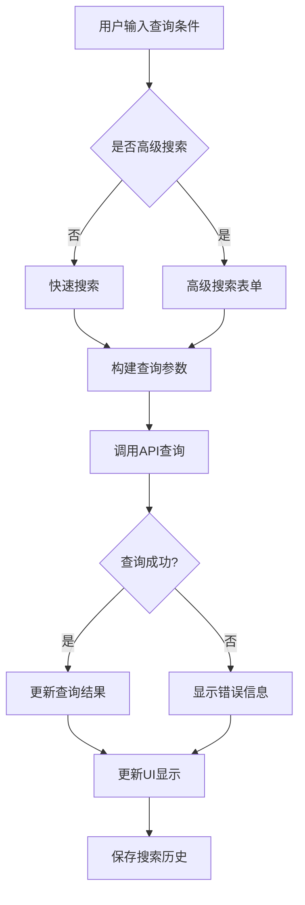

# MEL 查询功能页面设计

## 概述

基于 MEL 模块架构，详细设计 MEL 查询功能相关的页面，包括 MEL 列表查询、高级搜索和筛选功能。

## 页面结构

### 1. MEL 列表查询页 (`/pages/mel/list/index.vue`)

#### 1.1 页面功能
- 展示 MEL 记录列表
- 支持多种查询条件和筛选
- 提供排序和分页功能
- 支持列表和卡片两种视图模式

#### 1.2 页面布局
```
┌─────────────────────────────────────┐
│ 搜索栏                              │
├─────────────────────────────────────┤
│ 快速筛选标签                        │
├─────────────────────────────────────┤
│ 排序和视图切换                      │
├─────────────────────────────────────┤
│                                     │
│  MEL 列表内容                       │
│                                     │
├─────────────────────────────────────┤
│ 分页控件                            │
└─────────────────────────────────────┘
```

#### 1.3 组件结构
```vue
<template>
  <div class="mel-list-page">
    <!-- 搜索栏 -->
    <MelSearchBar 
      v-model="searchQuery"
      @search="handleSearch"
      @focus="showAdvancedSearch"
    />
    
    <!-- 快速筛选标签 -->
    <MelFilter 
      v-model="filters"
      :options="filterOptions"
      @change="handleFilterChange"
    />
    
    <!-- 排序和视图切换 -->
    <div class="list-controls">
      <MelSortSelector v-model="sortBy" @change="handleSortChange" />
      <ViewToggle v-model="viewMode" />
    </div>
    
    <!-- MEL 列表内容 -->
    <div class="list-content">
      <MelItem 
        v-for="item in melList"
        :key="item.id"
        :data="item"
        :view-mode="viewMode"
        @click="handleItemClick"
      />
    </div>
    
    <!-- 分页控件 -->
    <MelPagination 
      v-model="currentPage"
      :total="total"
      :page-size="pageSize"
      @change="handlePageChange"
    />
  </div>
</template>
```

#### 1.4 数据流
```typescript
// 查询参数接口
interface MelListQuery {
  searchQuery?: string;        // 搜索关键词
  filters: {                   // 筛选条件
    status?: string[];         // 状态筛选
    type?: string[];           // 类型筛选
    ata1?: string[];           // ATA章节筛选
    deffer?: string[];         // 保留类型筛选
    dateRange?: {              // 日期范围
      start: string;
      end: string;
      type: string;            // 日期类型
    };
  };
  sortBy: string;              // 排序字段
  sortOrder: 'asc' | 'desc';  // 排序方向
  currentPage: number;         // 当前页码
  pageSize: number;           // 每页数量
}
```

#### 1.5 功能特性
- **智能搜索**：支持模糊搜索和多字段搜索
- **快速筛选**：提供常用筛选条件的快速选择
- **高级筛选**：支持复杂条件组合筛选
- **多视图模式**：列表视图和卡片视图切换
- **排序功能**：支持多字段排序
- **分页加载**：支持分页和无限滚动
- **缓存机制**：缓存查询结果，提升用户体验

### 2. 高级搜索页面 (`/pages/mel/list/search.vue`)

#### 2.1 页面功能
- 提供完整的搜索条件表单
- 支持复杂条件组合查询
- 保存和管理搜索条件
- 提供搜索历史记录

#### 2.2 页面布局
```
┌─────────────────────────────────────┐
│ 搜索表单                            │
│ ┌─────────────────────────────────┐ │
│ │ 基础信息                        │ │
│ │ 飞机号: [______]               │ │
│ │ MEL编号: [______]              │ │
│ │ DDF单号: [______]              │ │
│ └─────────────────────────────────┘ │
│ ┌─────────────────────────────────┐ │
│ │ 日期范围                        │ │
│ │ 开始日期: [______]             │ │
│ │ 结束日期: [______]             │ │
│ │ 日期类型: [下拉选择]           │ │
│ └─────────────────────────────────┘ │
│ ┌─────────────────────────────────┐ │
│ │ 分类筛选                        │ │
│ │ 状态: [多选]                  │ │
│ │ 类型: [多选]                  │ │
│ │ ATA章节: [多选]               │ │
│ │ 保留类型: [多选]              │ │
│ └─────────────────────────────────┘ │
│ ┌─────────────────────────────────┐ │
│ │ 人员筛选                        │ │
│ │ 录入人: [______]              │ │
│ │ 批准人: [______]              │ │
│ │ 人员类型: [下拉选择]           │ │
│ └─────────────────────────────────┘ │
├─────────────────────────────────────┤
│ 操作按钮                            │
│ [重置] [保存条件] [搜索]           │
├─────────────────────────────────────┤
│ 搜索历史                            │
│ ┌─────────────────────────────────┐ │
│ │ 历史记录1                      │ │
│ │ 历史记录2                      │ │
│ └─────────────────────────────────┘ │
└─────────────────────────────────────┘
```

#### 2.3 组件结构
```vue
<template>
  <div class="mel-search-page">
    <!-- 搜索表单 -->
    <uni-forms ref="searchForm" :model="searchForm" :rules="formRules">
      <!-- 基础信息 -->
      <uni-section title="基础信息" type="line">
        <uni-forms-item label="飞机号" name="acReg">
          <uni-easyinput v-model="searchForm.acReg" placeholder="请输入飞机号" />
        </uni-forms-item>
        <uni-forms-item label="MEL编号" name="melNo">
          <uni-easyinput v-model="searchForm.melNo" placeholder="请输入MEL编号" />
        </uni-forms-item>
        <uni-forms-item label="DDF单号" name="ddfNo">
          <uni-easyinput v-model="searchForm.ddfNo" placeholder="请输入DDF单号" />
        </uni-forms-item>
      </uni-section>
      
      <!-- 日期范围 -->
      <uni-section title="日期范围" type="line">
        <uni-forms-item label="开始日期" name="startDate">
          <uni-datetime-picker v-model="searchForm.startDate" type="date" />
        </uni-forms-item>
        <uni-forms-item label="结束日期" name="endDate">
          <uni-datetime-picker v-model="searchForm.endDate" type="date" />
        </uni-forms-item>
        <uni-forms-item label="日期类型" name="dateType">
          <uni-data-select 
            v-model="searchForm.dateType"
            :localdata="dateTypeOptions"
          />
        </uni-forms-item>
      </uni-section>
      
      <!-- 分类筛选 -->
      <uni-section title="分类筛选" type="line">
        <uni-forms-item label="状态" name="status">
          <uni-data-checkbox 
            v-model="searchForm.status"
            :localdata="statusOptions"
            multiple
          />
        </uni-forms-item>
        <uni-forms-item label="类型" name="type">
          <uni-data-checkbox 
            v-model="searchForm.type"
            :localdata="typeOptions"
            multiple
          />
        </uni-forms-item>
        <uni-forms-item label="ATA章节" name="ata">
          <MelATASelector v-model="searchForm.ata" />
        </uni-forms-item>
        <uni-forms-item label="保留类型" name="deffer">
          <uni-data-checkbox 
            v-model="searchForm.deffer"
            :localdata="defferOptions"
            multiple
          />
        </uni-forms-item>
      </uni-section>
      
      <!-- 人员筛选 -->
      <uni-section title="人员筛选" type="line">
        <uni-forms-item label="录入人" name="inputter">
          <uni-easyinput v-model="searchForm.inputter" placeholder="请输入录入人" />
        </uni-forms-item>
        <uni-forms-item label="批准人" name="approver">
          <uni-easyinput v-model="searchForm.approver" placeholder="请输入批准人" />
        </uni-forms-item>
        <uni-forms-item label="人员类型" name="userIdType">
          <uni-data-select 
            v-model="searchForm.userIdType"
            :localdata="userTypeOptions"
          />
        </uni-forms-item>
      </uni-section>
    </uni-forms>
    
    <!-- 操作按钮 -->
    <div class="form-actions">
      <button @click="resetForm">重置</button>
      <button @click="saveSearchCondition">保存条件</button>
      <button type="primary" @click="handleSearch">搜索</button>
    </div>
    
    <!-- 搜索历史 -->
    <uni-section title="搜索历史" type="line">
      <div class="search-history">
        <div 
          v-for="(item, index) in searchHistory"
          :key="index"
          class="history-item"
          @click="applyHistoryCondition(item)"
        >
          <div class="history-name">{{ item.name }}</div>
          <div class="history-time">{{ formatTime(item.createTime) }}</div>
          <div class="history-delete" @click.stop="deleteHistoryItem(index)">
            <uni-icons type="clear" size="16" />
          </div>
        </div>
      </div>
    </uni-section>
  </div>
</template>
```

#### 2.4 数据结构
```typescript
// 搜索表单数据
interface MelSearchForm {
  // 基础信息
  acReg?: string;           // 飞机号
  melNo?: string;           // MEL编号
  ddfNo?: string;           // DDF单号
  
  // 日期范围
  startDate?: string;        // 开始日期
  endDate?: string;          // 结束日期
  dateType?: string;         // 日期类型
  
  // 分类筛选
  status?: string[];         // 状态
  type?: string[];           // 类型
  ata?: string[];            // ATA章节
  deffer?: string[];         // 保留类型
  
  // 人员筛选
  inputter?: string;         // 录入人
  approver?: string;         // 批准人
  userIdType?: string;       // 人员类型
}

// 搜索历史记录
interface SearchHistoryItem {
  id: string;               // 唯一标识
  name: string;              // 搜索名称
  condition: MelSearchForm;  // 搜索条件
  createTime: string;        // 创建时间
  useCount: number;          // 使用次数
}
```

#### 2.5 功能特性
- **表单验证**：支持字段验证和错误提示
- **条件保存**：保存常用搜索条件，方便快速使用
- **搜索历史**：记录搜索历史，支持快速重复搜索
- **智能提示**：提供输入提示和自动完成
- **条件重置**：一键重置所有搜索条件
- **条件导入导出**：支持搜索条件的导入导出

## 组件设计

### 1. MelSearchBar 组件

#### 1.1 功能
- 提供快速搜索输入框
- 支持搜索历史和自动完成
- 支持高级搜索入口

#### 1.2 组件结构
```vue
<template>
  <div class="mel-search-bar">
    <div class="search-input-container">
      <uni-icons type="search" size="16" />
      <input 
        v-model="searchQuery"
        type="text"
        placeholder="搜索MEL编号、飞机号、DDF单号..."
        @focus="handleFocus"
        @blur="handleBlur"
        @input="handleInput"
        @confirm="handleSearch"
      />
      <button v-if="searchQuery" @click="clearSearch">
        <uni-icons type="clear" size="16" />
      </button>
    </div>
    
    <!-- 搜索建议下拉框 -->
    <div v-if="showSuggestions" class="search-suggestions">
      <div 
        v-for="(item, index) in suggestions"
        :key="index"
        class="suggestion-item"
        @click="selectSuggestion(item)"
      >
        <div class="suggestion-text">{{ item.text }}</div>
        <div class="suggestion-type">{{ item.type }}</div>
      </div>
    </div>
  </div>
</template>
```

### 2. MelFilter 组件

#### 2.1 功能
- 提供快速筛选标签
- 支持多条件筛选
- 支持筛选条件管理

#### 2.2 组件结构
```vue
<template>
  <div class="mel-filter">
    <scroll-view scroll-x class="filter-scroll">
      <div class="filter-tags">
        <div 
          v-for="(option, key) in filterOptions"
          :key="key"
          class="filter-group"
        >
          <span class="filter-label">{{ option.label }}:</span>
          <div class="filter-values">
            <div 
              v-for="value in option.values"
              :key="value.value"
              class="filter-tag"
              :class="{ active: isActive(key, value.value) }"
              @click="toggleFilter(key, value.value)"
            >
              {{ value.label }}
            </div>
          </div>
        </div>
      </div>
    </scroll-view>
    
    <!-- 更多筛选按钮 -->
    <button class="more-filter-btn" @click="showMoreFilter">
      <uni-icons type="more" size="16" />
      更多筛选
    </button>
  </div>
</template>
```

### 3. MelItem 组件

#### 3.1 功能
- 展示单个 MEL 记录
- 支持列表和卡片两种视图
- 支持点击跳转详情

#### 3.2 组件结构
```vue
<template>
  <div 
    class="mel-item"
    :class="[`view-${viewMode}`, { selected: isSelected }]"
    @click="handleClick"
  >
    <!-- 列表视图 -->
    <div v-if="viewMode === 'list'" class="list-view">
      <div class="item-header">
        <span class="mel-no">{{ data.melNo }}</span>
        <MelStatusBadge :status="data.status" />
      </div>
      <div class="item-content">
        <div class="aircraft-info">{{ data.acReg }} ({{ data.acType }})</div>
        <div class="description">{{ data.des }}</div>
      </div>
      <div class="item-footer">
        <span class="ata-info">ATA {{ data.ata1 }}-{{ data.ata2 }}</span>
        <span class="date-info">{{ formatDate(data.applyDate) }}</span>
      </div>
    </div>
    
    <!-- 卡片视图 -->
    <div v-else class="card-view">
      <div class="card-header">
        <span class="mel-no">{{ data.melNo }}</span>
        <MelStatusBadge :status="data.status" />
      </div>
      <div class="card-content">
        <div class="description">{{ data.des }}</div>
        <div class="info-grid">
          <div class="info-item">
            <span class="label">飞机:</span>
            <span class="value">{{ data.acReg }}</span>
          </div>
          <div class="info-item">
            <span class="label">ATA:</span>
            <span class="value">{{ data.ata1 }}-{{ data.ata2 }}</span>
          </div>
          <div class="info-item">
            <span class="label">日期:</span>
            <span class="value">{{ formatDate(data.applyDate) }}</span>
          </div>
        </div>
      </div>
    </div>
  </div>
</template>
```

### 4. MelPagination 组件

#### 4.1 功能
- 提供分页控件
- 支持页码跳转
- 支持每页数量调整

#### 4.2 组件结构
```vue
<template>
  <div class="mel-pagination">
    <div class="pagination-info">
      <span>共 {{ total }} 条记录</span>
      <span>第 {{ currentPage }} / {{ totalPages }} 页</span>
    </div>
    
    <div class="pagination-controls">
      <button 
        :disabled="currentPage <= 1"
        @click="goToPage(currentPage - 1)"
      >
        上一页
      </button>
      
      <div class="page-numbers">
        <button 
          v-for="page in visiblePages"
          :key="page"
          :class="{ active: page === currentPage }"
          @click="goToPage(page)"
        >
          {{ page }}
        </button>
      </div>
      
      <button 
        :disabled="currentPage >= totalPages"
        @click="goToPage(currentPage + 1)"
      >
        下一页
      </button>
    </div>
    
    <div class="page-size-selector">
      <span>每页显示:</span>
      <select v-model="localPageSize" @change="handlePageSizeChange">
        <option v-for="size in pageSizeOptions" :key="size" :value="size">
          {{ size }}
        </option>
      </select>
    </div>
  </div>
</template>
```

## 数据流和状态管理

### 1. 查询状态管理

```typescript
// 扩展现有的 MelStore
interface MelQueryState {
  // 查询参数
  queryParams: MelListQuery;
  
  // 查询结果
  queryResult: {
    list: VMel[];
    total: number;
    currentPage: number;
    pageSize: number;
  };
  
  // 查询状态
  queryStates: {
    loading: boolean;
    error: string | null;
    hasMore: boolean;
  };
  
  // 搜索历史
  searchHistory: SearchHistoryItem[];
  
  // 保存的搜索条件
  savedConditions: SearchHistoryItem[];
}
```

### 2. 查询流程



### 3. 缓存策略

```typescript
// 查询结果缓存
interface QueryCache {
  key: string;              // 查询参数的哈希值
  data: MelPageResponse;    // 查询结果
  timestamp: number;        // 缓存时间
  expireTime: number;       // 过期时间
}

// 缓存管理
class MelQueryCache {
  private cache: Map<string, QueryCache> = new Map();
  private maxCacheSize = 50;  // 最大缓存数量
  private defaultExpireTime = 5 * 60 * 1000;  // 默认5分钟过期
  
  // 获取缓存
  get(key: string): QueryCache | null {
    const item = this.cache.get(key);
    if (!item) return null;
    
    // 检查是否过期
    if (Date.now() - item.timestamp > item.expireTime) {
      this.cache.delete(key);
      return null;
    }
    
    return item;
  }
  
  // 设置缓存
  set(key: string, data: MelPageResponse, expireTime?: number): void {
    // 如果缓存已满，删除最旧的缓存
    if (this.cache.size >= this.maxCacheSize) {
      const firstKey = this.cache.keys().next().value;
      this.cache.delete(firstKey);
    }
    
    this.cache.set(key, {
      key,
      data,
      timestamp: Date.now(),
      expireTime: expireTime || this.defaultExpireTime
    });
  }
  
  // 清除缓存
  clear(): void {
    this.cache.clear();
  }
}
```

## 用户体验优化

### 1. 加载状态处理

```typescript
// 加载状态管理
interface LoadingStates {
  initial: boolean;      // 初始加载
  refreshing: boolean;    // 下拉刷新
  loadingMore: boolean;  // 加载更多
  searching: boolean;    // 搜索中
}

// 加载状态组件
<template>
  <div class="loading-container">
    <!-- 初始加载 -->
    <div v-if="loadingStates.initial" class="initial-loading">
      <uni-load-more status="loading" />
    </div>
    
    <!-- 下拉刷新 -->
    <div v-if="loadingStates.refreshing" class="refresh-loading">
      <uni-load-more status="loading" />
    </div>
    
    <!-- 加载更多 -->
    <div v-if="loadingStates.loadingMore" class="load-more-loading">
      <uni-load-more status="loading" />
    </div>
    
    <!-- 搜索中 -->
    <div v-if="loadingStates.searching" class="search-loading">
      <uni-load-more status="loading" />
    </div>
  </div>
</template>
```

### 2. 错误处理

```typescript
// 错误处理策略
interface ErrorHandling {
  // 网络错误
  networkError: {
    message: string;
    retryAction: () => void;
  };
  
  // 查询错误
  queryError: {
    message: string;
    details: string;
    retryAction: () => void;
  };
  
  // 数据错误
  dataError: {
    message: string;
    fallbackData: any;
  };
}
```

### 3. 性能优化

```typescript
// 性能优化策略
class PerformanceOptimization {
  // 虚拟滚动
  virtualScroll: {
    itemHeight: number;
    visibleCount: number;
    bufferSize: number;
  };
  
  // 防抖搜索
  debounceSearch: {
    delay: number;
    timer: NodeJS.Timeout | null;
  };
  
  // 图片懒加载
  lazyLoad: {
    threshold: number;
    rootMargin: string;
  };
}
```

## 测试策略

### 1. 单元测试

```typescript
// 组件测试示例
describe('MelSearchBar', () => {
  it('should emit search event when user confirms search', async () => {
    const wrapper = mount(MelSearchBar);
    await wrapper.setData({ searchQuery: 'B-1234' });
    
    const input = wrapper.find('input');
    await input.trigger('confirm');
    
    expect(wrapper.emitted('search')).toBeTruthy();
    expect(wrapper.emitted('search')[0]).toEqual(['B-1234']);
  });
  
  it('should show suggestions when user types', async () => {
    const wrapper = mount(MelSearchBar);
    await wrapper.setData({ searchQuery: 'B' });
    
    expect(wrapper.find('.search-suggestions').exists()).toBe(true);
  });
});
```

### 2. 集成测试

```typescript
// 页面集成测试示例
describe('Mel List Page', () => {
  it('should load and display MEL data', async () => {
    const mockData = generateMockMelData();
    jest.spyOn(melApi, 'getMelList').mockResolvedValue(mockData);
    
    const wrapper = mount(MelListPage);
    await wrapper.vm.$nextTick();
    
    expect(wrapper.find('.mel-item').exists()).toBe(true);
    expect(wrapper.findAll('.mel-item')).toHaveLength(mockData.records.length);
  });
});
```

## 总结

MEL 查询功能页面设计提供了完整的 MEL 数据查询和筛选功能，包括：

1. **MEL 列表查询页**：提供列表展示、快速筛选、排序和分页功能
2. **高级搜索页面**：提供完整的搜索表单和条件管理功能
3. **组件化设计**：通过组件化实现代码复用和维护性
4. **性能优化**：通过缓存、虚拟滚动等方式提升性能
5. **用户体验**：通过加载状态、错误处理等提升用户体验

这些页面和组件共同构成了一个功能完整、性能优良、用户体验良好的 MEL 查询系统。