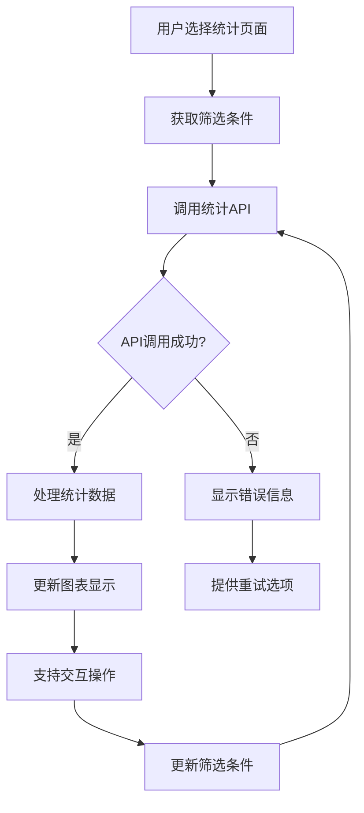

# MEL 统计分析页面设计

## 概述

基于 MEL 模块架构，设计 MEL 统计分析相关的页面，提供多维度的 MEL 数据统计和可视化分析功能。

## 页面结构

### 1. 统计概览页面 (`/pages/mel/stats/index.vue`)

#### 1.1 页面功能
- 展示 MEL 数据的总体统计概览
- 提供关键指标的快速查看
- 支持时间范围筛选
- 提供各专项统计的快速入口

#### 1.2 页面布局
```
┌─────────────────────────────────────┐
│ 时间范围选择器                      │
├─────────────────────────────────────┤
│ 关键指标卡片                        │
│ ┌─────┐ ┌─────┐ ┌─────┐ ┌─────┐ │
│ │总数 │ │待批 │ │已批 │ │已关 │ │
│ └─────┘ └─────┘ └─────┘ └─────┘ │
├─────────────────────────────────────┤
│ 趋势图表                            │
│ ┌─────────────────────────────────┐ │
│ │        月度趋势图              │ │
│ └─────────────────────────────────┘ │
├─────────────────────────────────────┤
│ 分布图表                            │
│ ┌─────────────────┐ ┌─────────────┐ │
│ │   状态分布图    │ │  ATA分布图  │ │
│ └─────────────────┘ └─────────────┘ │
├─────────────────────────────────────┤
│ 快速统计入口                        │
│ ┌─────┐ ┌─────┐ ┌─────┐ ┌─────┐ │
│ │状态 │ │ATA  │ │月度 │ │飞机 │ │
│ │统计 │ │统计 │ │统计 │ │统计 │ │
│ └─────┘ └─────┘ └─────┘ └─────┘ │
└─────────────────────────────────────┘
```

#### 1.3 组件结构
```vue
<template>
  <div class="mel-stats-overview">
    <!-- 时间范围选择器 -->
    <MelDateRangePicker 
      v-model="dateRange"
      :options="dateRangeOptions"
      @change="handleDateRangeChange"
    />
    
    <!-- 关键指标卡片 -->
    <div class="key-metrics">
      <StatsCard 
        v-for="metric in keyMetrics"
        :key="metric.key"
        :title="metric.title"
        :value="metric.value"
        :trend="metric.trend"
        :icon="metric.icon"
        :color="metric.color"
      />
    </div>
    
    <!-- 趋势图表 -->
    <div class="trend-chart">
      <ChartContainer 
        title="月度趋势"
        type="line"
        :data="trendData"
        :options="trendChartOptions"
      />
    </div>
    
    <!-- 分布图表 -->
    <div class="distribution-charts">
      <ChartContainer 
        title="状态分布"
        type="pie"
        :data="statusDistribution"
        :options="pieChartOptions"
      />
      <ChartContainer 
        title="ATA章节分布"
        type="bar"
        :data="ataDistribution"
        :options="barChartOptions"
      />
    </div>
    
    <!-- 快速统计入口 -->
    <div class="quick-stats">
      <div 
        v-for="entry in quickStatsEntries"
        :key="entry.key"
        class="stats-entry"
        @click="navigateToStats(entry.path)"
      >
        <uni-icons :type="entry.icon" size="24" />
        <span>{{ entry.title }}</span>
      </div>
    </div>
  </div>
</template>
```

#### 1.4 数据结构
```typescript
// 关键指标数据
interface KeyMetric {
  key: string;              // 指标键值
  title: string;            // 指标标题
  value: number;            // 指标值
  trend: {                  // 趋势数据
    value: number;          // 趋势值
    direction: 'up' | 'down' | 'stable';  // 趋势方向
    percentage: number;      // 变化百分比
  };
  icon: string;             // 图标
  color: string;            // 颜色
}

// 趋势数据
interface TrendData {
  period: string;           // 时间周期
  total: number;            // 总数
  approved: number;         // 已批准数
  pending: number;          // 待批准数
  closed: number;           // 已关闭数
}

// 分布数据
interface DistributionData {
  name: string;             // 名称
  value: number;            // 数值
  percentage?: number;       // 百分比
}
```

### 2. 状态统计页面 (`/pages/mel/stats/status.vue`)

#### 2.1 页面功能
- 展示 MEL 状态分布的详细统计
- 提供状态趋势分析
- 支持状态筛选和详情查看
- 提供状态变更时间线

#### 2.2 页面布局
```
┌─────────────────────────────────────┐
│ 状态分布饼图                        │
│ ┌─────────────────────────────────┐ │
│ │                               │ │
│ │        状态分布图              │ │
│ │                               │ │
│ └─────────────────────────────────┘ │
├─────────────────────────────────────┤
│ 状态趋势图                          │
│ ┌─────────────────────────────────┐ │
│ │        状态趋势图              │ │
│ └─────────────────────────────────┘ │
├─────────────────────────────────────┤
│ 状态详情列表                        │
│ ┌─────────────────────────────────┐ │
│ │ 状态 | 数量 | 百分比 | 趋势   │ │
│ │ 已批准 | 80  | 80%   | ↑     │ │
│ │ 待批准 | 15  | 15%   | →     │ │
│ │ 已拒绝 | 5   | 5%    | ↓     │ │
│ └─────────────────────────────────┘ │
├─────────────────────────────────────┤
│ 状态变更时间线                      │
│ ┌─────────────────────────────────┐ │
│ │ 2023-01-01  待批准→已批准      │ │
│ │ 2023-01-02  已批准→已关闭      │ │
│ └─────────────────────────────────┘ │
└─────────────────────────────────────┘
```

#### 2.3 组件结构
```vue
<template>
  <div class="mel-status-stats">
    <!-- 状态分布饼图 -->
    <div class="status-pie-chart">
      <ChartContainer 
        title="状态分布"
        type="pie"
        :data="statusDistribution"
        :options="pieChartOptions"
        @item-click="handleStatusClick"
      />
    </div>
    
    <!-- 状态趋势图 -->
    <div class="status-trend-chart">
      <ChartContainer 
        title="状态趋势"
        type="line"
        :data="statusTrend"
        :options="trendChartOptions"
      />
    </div>
    
    <!-- 状态详情列表 -->
    <div class="status-details">
      <div class="detail-header">
        <span>状态详情</span>
        <button @click="exportStatusData">导出数据</button>
      </div>
      <div class="detail-list">
        <div 
          v-for="item in statusDetails"
          :key="item.status"
          class="detail-item"
          @click="filterByStatus(item.status)"
        >
          <MelStatusBadge :status="item.status" />
          <span class="count">{{ item.count }}</span>
          <span class="percentage">{{ item.percentage }}%</span>
          <span class="trend" :class="item.trend.direction">
            {{ item.trend.value }}
          </span>
        </div>
      </div>
    </div>
    
    <!-- 状态变更时间线 -->
    <div class="status-timeline">
      <div class="timeline-header">
        <span>状态变更时间线</span>
        <button @click="loadMoreTimeline">加载更多</button>
      </div>
      <div class="timeline-list">
        <div 
          v-for="item in statusTimeline"
          :key="item.id"
          class="timeline-item"
        >
          <div class="timeline-date">{{ formatDate(item.date) }}</div>
          <div class="timeline-content">
            <span class="mel-info">{{ item.melNo }} - {{ item.acReg }}</span>
            <span class="status-change">
              {{ item.fromStatus }} → {{ item.toStatus }}
            </span>
          </div>
        </div>
      </div>
    </div>
  </div>
</template>
```

### 3. ATA 章节统计页面 (`/pages/mel/stats/ata.vue`)

#### 3.1 页面功能
- 展示 ATA 章节分布的详细统计
- 提供高频 ATA 章节排行
- 支持 ATA 章节筛选和详情查看
- 提供 ATA 章节趋势分析

#### 3.2 页面布局
```
┌─────────────────────────────────────┐
│ ATA章节分布图                       │
│ ┌─────────────────────────────────┐ │
│ │        ATA章节分布图            │ │
│ └─────────────────────────────────┘ │
├─────────────────────────────────────┤
│ 高频ATA章节排行                     │
│ ┌─────────────────────────────────┐ │
│ │ 排名 | ATA章节 | 数量 | 百分比│ │
│ │ 1    | 27     | 45   | 45%   │ │
│ │ 2    | 32     | 30   | 30%   │ │
│ │ 3    | 21     | 25   | 25%   │ │
│ └─────────────────────────────────┘ │
├─────────────────────────────────────┤
│ ATA章节趋势图                       │
│ ┌─────────────────────────────────┐ │
│ │        ATA章节趋势图            │ │
│ └─────────────────────────────────┘ │
├─────────────────────────────────────┤
│ ATA章节详情列表                     │
│ ┌─────────────────────────────────┐ │
│ │ ATA章节 | 描述 | 数量 | 趋势  │ │
│ │ 27      | 飞控 | 45   | ↑     │ │
│ │ 32      | 起落 | 30   | →     │ │
│ │ 21      | 空调 | 25   | ↓     │ │
│ └─────────────────────────────────┘ │
└─────────────────────────────────────┘
```

#### 3.3 组件结构
```vue
<template>
  <div class="mel-ata-stats">
    <!-- ATA章节分布图 -->
    <div class="ata-distribution-chart">
      <ChartContainer 
        title="ATA章节分布"
        type="bar"
        :data="ataDistribution"
        :options="barChartOptions"
        @item-click="handleAtaClick"
      />
    </div>
    
    <!-- 高频ATA章节排行 -->
    <div class="ata-ranking">
      <div class="ranking-header">
        <span>高频ATA章节排行</span>
        <button @click="exportAtaData">导出数据</button>
      </div>
      <div class="ranking-list">
        <div 
          v-for="(item, index) in ataRanking"
          :key="item.ata"
          class="ranking-item"
          @click="filterByAta(item.ata)"
        >
          <span class="rank">{{ index + 1 }}</span>
          <MelATATag :ata="item.ata" />
          <span class="count">{{ item.count }}</span>
          <span class="percentage">{{ item.percentage }}%</span>
        </div>
      </div>
    </div>
    
    <!-- ATA章节趋势图 -->
    <div class="ata-trend-chart">
      <ChartContainer 
        title="ATA章节趋势"
        type="line"
        :data="ataTrend"
        :options="trendChartOptions"
      />
    </div>
    
    <!-- ATA章节详情列表 -->
    <div class="ata-details">
      <div class="detail-header">
        <span>ATA章节详情</span>
        <MelATASelector v-model="selectedAta" @change="handleAtaChange" />
      </div>
      <div class="detail-list">
        <div 
          v-for="item in ataDetails"
          :key="item.ata"
          class="detail-item"
          @click="viewAtaDetail(item.ata)"
        >
          <MelATATag :ata="item.ata" />
          <span class="description">{{ item.description }}</span>
          <span class="count">{{ item.count }}</span>
          <span class="trend" :class="item.trend.direction">
            {{ item.trend.value }}
          </span>
        </div>
      </div>
    </div>
  </div>
</template>
```

### 4. 月度统计页面 (`/pages/mel/stats/monthly.vue`)

#### 4.1 页面功能
- 展示 MEL 数据的月度趋势分析
- 提供同比/环比分析
- 支持月度数据对比
- 提供月度报表导出

#### 4.2 页面布局
```
┌─────────────────────────────────────┐
│ 年份和月份选择器                     │
├─────────────────────────────────────┤
│ 月度趋势图                          │
│ ┌─────────────────────────────────┐ │
│ │        月度趋势图              │ │
│ └─────────────────────────────────┘ │
├─────────────────────────────────────┤
│ 同比/环比分析                       │
│ ┌─────────────────────────────────┐ │
│ │ 指标 | 本月 | 上月 | 同比 | 环比│ │
│ │ 总数 | 100  | 90   | +20% | +11%│ │
│ │ 已批 | 80   | 75   | +15% | +7% │ │
│ │ 待批 | 15   | 10   | +50% | +50%│ │
│ └─────────────────────────────────┘ │
├─────────────────────────────────────┤
│ 月度数据对比                        │
│ ┌─────────────────────────────────┐ │
│ │ 对比月份1 | 对比月份2 | 差异   │ │
│ │ 2023-01  | 2023-02  | +10   │ │
│ │ 2023-02  | 2023-03  | -5    │ │
│ └─────────────────────────────────┘ │
├─────────────────────────────────────┤
│ 月度报表导出                        │
│ ┌─────────────────────────────────┐ │
│ │ [导出Excel] [导出PDF] [打印]  │ │
│ └─────────────────────────────────┘ │
└─────────────────────────────────────┘
```

#### 4.3 组件结构
```vue
<template>
  <div class="mel-monthly-stats">
    <!-- 年份和月份选择器 -->
    <div class="date-selector">
      <MelYearMonthPicker 
        v-model="selectedDate"
        :options="dateOptions"
        @change="handleDateChange"
      />
    </div>
    
    <!-- 月度趋势图 -->
    <div class="monthly-trend-chart">
      <ChartContainer 
        title="月度趋势"
        type="line"
        :data="monthlyTrend"
        :options="trendChartOptions"
      />
    </div>
    
    <!-- 同比/环比分析 -->
    <div class="comparison-analysis">
      <div class="analysis-header">
        <span>同比/环比分析</span>
        <button @click="exportComparisonData">导出数据</button>
      </div>
      <div class="analysis-table">
        <div class="table-header">
          <span>指标</span>
          <span>本月</span>
          <span>上月</span>
          <span>同比</span>
          <span>环比</span>
        </div>
        <div 
          v-for="item in comparisonData"
          :key="item.metric"
          class="table-row"
        >
          <span class="metric">{{ item.metric }}</span>
          <span class="current">{{ item.current }}</span>
          <span class="previous">{{ item.previous }}</span>
          <span class="year-over-year" :class="item.yoy.direction">
            {{ item.yoy.value }}
          </span>
          <span class="month-over-month" :class="item.mom.direction">
            {{ item.mom.value }}
          </span>
        </div>
      </div>
    </div>
    
    <!-- 月度数据对比 -->
    <div class="monthly-comparison">
      <div class="comparison-header">
        <span>月度数据对比</span>
        <div class="comparison-controls">
          <MelMonthPicker v-model="compareMonth1" placeholder="选择月份1" />
          <span>VS</span>
          <MelMonthPicker v-model="compareMonth2" placeholder="选择月份2" />
          <button @click="compareMonths">对比</button>
        </div>
      </div>
      <div class="comparison-result">
        <ChartContainer 
          title="月度对比"
          type="bar"
          :data="comparisonResult"
          :options="comparisonChartOptions"
        />
      </div>
    </div>
    
    <!-- 月度报表导出 -->
    <div class="monthly-export">
      <div class="export-header">
        <span>月度报表导出</span>
      </div>
      <div class="export-options">
        <button @click="exportToExcel">导出Excel</button>
        <button @click="exportToPDF">导出PDF</button>
        <button @click="printReport">打印报表</button>
      </div>
    </div>
  </div>
</template>
```

## 组件设计

### 1. StatsCard 组件

#### 1.1 功能
- 展示关键指标卡片
- 支持趋势显示
- 支持自定义样式

#### 1.2 组件结构
```vue
<template>
  <div class="stats-card" :class="[`color-${color}`]">
    <div class="card-header">
      <uni-icons :type="icon" size="24" />
      <span class="title">{{ title }}</span>
    </div>
    <div class="card-content">
      <div class="value">{{ formatValue(value) }}</div>
      <div class="trend" :class="trend.direction">
        <uni-icons 
          :type="getTrendIcon(trend.direction)" 
          size="12" 
        />
        <span>{{ trend.percentage }}%</span>
      </div>
    </div>
  </div>
</template>
```

### 2. ChartContainer 组件

#### 2.1 功能
- 图表容器组件
- 支持多种图表类型
- 支持交互事件

#### 2.2 组件结构
```vue
<template>
  <div class="chart-container">
    <div class="chart-header">
      <span class="title">{{ title }}</span>
      <div class="chart-controls">
        <button @click="refreshChart">
          <uni-icons type="refresh" size="16" />
        </button>
        <button @click="downloadChart">
          <uni-icons type="download" size="16" />
        </button>
      </div>
    </div>
    <div class="chart-content">
      <component 
        :is="chartComponent"
        :data="data"
        :options="mergedOptions"
        @item-click="handleItemClick"
        @legend-click="handleLegendClick"
      />
    </div>
  </div>
</template>
```

### 3. MelDateRangePicker 组件

#### 3.1 功能
- 日期范围选择器
- 支持快速选择常用范围
- 支持自定义日期范围

#### 3.2 组件结构
```vue
<template>
  <div class="mel-date-range-picker">
    <div class="preset-ranges">
      <button 
        v-for="range in presetRanges"
        :key="range.key"
        :class="{ active: isActiveRange(range) }"
        @click="selectPresetRange(range)"
      >
        {{ range.label }}
      </button>
    </div>
    <div class="custom-range">
      <div class="date-inputs">
        <div class="date-input">
          <span>开始日期</span>
          <uni-datetime-picker 
            v-model="customRange.start"
            type="date"
            @change="handleDateChange"
          />
        </div>
        <div class="date-input">
          <span>结束日期</span>
          <uni-datetime-picker 
            v-model="customRange.end"
            type="date"
            @change="handleDateChange"
          />
        </div>
      </div>
    </div>
  </div>
</template>
```

### 4. MelATASelector 组件

#### 4.1 功能
- ATA 章节选择器
- 支持多级选择
- 支持搜索和筛选

#### 4.2 组件结构
```vue
<template>
  <div class="mel-ata-selector">
    <div class="selector-input" @click="showSelector">
      <span v-if="selectedAta">{{ selectedAta }}</span>
      <span v-else class="placeholder">请选择ATA章节</span>
      <uni-icons type="arrowdown" size="16" />
    </div>
    
    <div v-if="selectorVisible" class="selector-dropdown">
      <div class="search-box">
        <input 
          v-model="searchQuery"
          type="text"
          placeholder="搜索ATA章节..."
          @input="handleSearch"
        />
      </div>
      <div class="ata-tree">
        <div 
          v-for="chapter in filteredAtaChapters"
          :key="chapter.code"
          class="ata-chapter"
          @click="selectChapter(chapter)"
        >
          <span class="chapter-code">{{ chapter.code }}</span>
          <span class="chapter-description">{{ chapter.description }}</span>
        </div>
      </div>
    </div>
  </div>
</template>
```

## 数据流和状态管理

### 1. 统计数据状态管理

```typescript
// 扩展现有的 MelStore
interface MelStatsState {
  // 统计数据
  statsData: {
    overview: {
      keyMetrics: KeyMetric[];
      trendData: TrendData[];
      statusDistribution: DistributionData[];
      ataDistribution: DistributionData[];
    };
    status: {
      distribution: DistributionData[];
      trend: TrendData[];
      details: StatusDetail[];
      timeline: StatusTimeline[];
    };
    ata: {
      distribution: DistributionData[];
      ranking: ATARanking[];
      trend: TrendData[];
      details: ATADetail[];
    };
    monthly: {
      trend: TrendData[];
      comparison: ComparisonData[];
      analysis: AnalysisData[];
    };
  };
  
  // 统计状态
  statsStates: {
    loading: boolean;
    error: string | null;
    lastUpdated: string | null;
  };
  
  // 筛选条件
  statsFilters: {
    dateRange: {
      start: string;
      end: string;
    };
    status: string[];
    ata: string[];
    aircraft: string[];
  };
}
```

### 2. 统计数据获取流程



### 3. 图表配置管理

```typescript
// 图表配置
interface ChartConfig {
  // 饼图配置
  pie: {
    colors: string[];
    legend: {
      show: boolean;
      position: 'top' | 'bottom' | 'left' | 'right';
    };
    tooltip: {
      show: boolean;
      formatter: string;
    };
  };
  
  // 柱状图配置
  bar: {
    colors: string[];
    xAxis: {
      type: 'category' | 'value';
      rotate: number;
    };
    yAxis: {
      type: 'category' | 'value';
    };
  };
  
  // 折线图配置
  line: {
    colors: string[];
    smooth: boolean;
    point: {
      show: boolean;
      size: number;
    };
  };
}
```

## 用户体验优化

### 1. 数据加载优化

```typescript
// 数据加载策略
class DataLoadingStrategy {
  // 并行加载
  parallelLoad: {
    enabled: boolean;
    maxConcurrent: number;
  };
  
  // 分批加载
  batchLoad: {
    enabled: boolean;
    batchSize: number;
  };
  
  // 预加载
  preload: {
    enabled: boolean;
    preloadPages: string[];
  };
}
```

### 2. 图表交互优化

```typescript
// 图表交互配置
interface ChartInteraction {
  // 缩放
  zoom: {
    enabled: boolean;
    wheel: boolean;
    pinch: boolean;
  };
  
  // 平移
  pan: {
    enabled: boolean;
    threshold: number;
  };
  
  // 交叉高亮
  crosshair: {
    enabled: boolean;
    style: {
      color: string;
      width: number;
      type: 'solid' | 'dashed';
    };
  };
  
  // 数据标签
  dataLabel: {
    enabled: boolean;
    position: 'top' | 'center' | 'bottom';
    formatter: string;
  };
}
```

### 3. 响应式设计

```typescript
// 响应式配置
interface ResponsiveConfig {
  // 断点
  breakpoints: {
    mobile: number;
    tablet: number;
    desktop: number;
  };
  
  // 图表适配
  chartAdaptation: {
    mobile: {
      height: number;
      fontSize: number;
      legendPosition: string;
    };
    tablet: {
      height: number;
      fontSize: number;
      legendPosition: string;
    };
    desktop: {
      height: number;
      fontSize: number;
      legendPosition: string;
    };
  };
}
```

## 测试策略

### 1. 组件测试

```typescript
// 组件测试示例
describe('StatsCard', () => {
  it('should display metric value correctly', () => {
    const metric = {
      title: '总数',
      value: 100,
      trend: { direction: 'up', percentage: 10 },
      icon: 'info',
      color: 'blue'
    };
    
    const wrapper = mount(StatsCard, {
      props: { metric }
    });
    
    expect(wrapper.find('.value').text()).toBe('100');
    expect(wrapper.find('.title').text()).toBe('总数');
  });
  
  it('should show correct trend direction', () => {
    const metric = {
      title: '总数',
      value: 100,
      trend: { direction: 'up', percentage: 10 },
      icon: 'info',
      color: 'blue'
    };
    
    const wrapper = mount(StatsCard, {
      props: { metric }
    });
    
    expect(wrapper.find('.trend').classes()).toContain('up');
  });
});
```

### 2. 集成测试

```typescript
// 页面集成测试示例
describe('MEL Stats Overview', () => {
  it('should load and display statistics data', async () => {
    const mockData = generateMockStatsData();
    jest.spyOn(melApi, 'getMelStats').mockResolvedValue(mockData);
    
    const wrapper = mount(MelStatsOverview);
    await wrapper.vm.$nextTick();
    
    expect(wrapper.find('.stats-card').exists()).toBe(true);
    expect(wrapper.findAll('.stats-card')).toHaveLength(4);
  });
});
```

## 总结

MEL 统计分析页面设计提供了完整的 MEL 数据统计和可视化分析功能，包括：

1. **统计概览页面**：提供总体统计和快速入口
2. **状态统计页面**：提供状态分布和趋势分析
3. **ATA 章节统计页面**：提供 ATA 章节分布和排行
4. **月度统计页面**：提供月度趋势和对比分析

这些页面通过丰富的图表和交互功能，帮助用户深入了解 MEL 数据的分布和趋势，为决策提供数据支持。